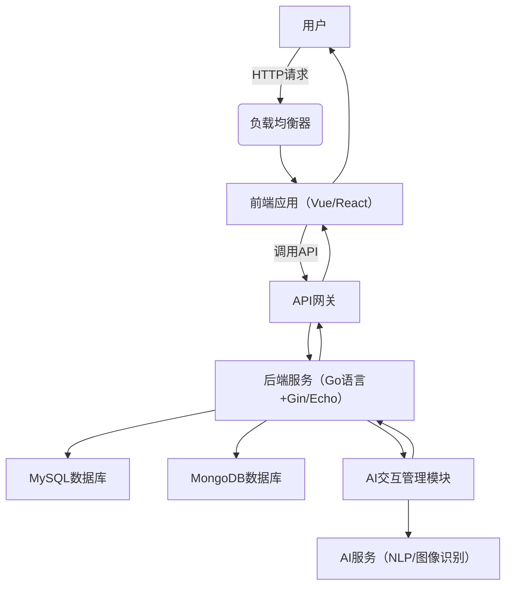

AI 交友网站 MVP 版本产品需求文档及技术方案（Go 语言版）


一、产品需求文档（PRD）


### 1.1 产品定位&#xA;

本 AI 交友网站面向 20-35 岁、生活在一二线城市、热爱生活的年轻群体，打造融合真人社交与 AI 陪伴的综合性交友平台。用户无需刻意区分交互对象，系统通过智能算法实现 AI 与真人交友的无感知切换，提供连贯、自然的社交体验。


### 1.2 目标用户&#xA;


*   **年龄**：20-35 岁


*   **地域**：一二线城市


*   **特征**：追求高效社交，对 AI 技术接受度高，渴望拓展社交圈，满足多样化社交需求


### 1.3 核心价值&#xA;

通过 AI 与真人交友的无缝融合，降低社交门槛，利用 AI 弥补真人社交等待时间与话题冷场问题，同时通过真人互动提供真实情感连接，提升交友效率与质量。


### 1.4 MVP 目标&#xA;

推出具备核心功能的最小可行产品，验证市场需求，吸引 1000 名种子用户，收集反馈以优化迭代。


二、功能需求


### 2.1 用户注册与登录&#xA;


*   **注册方式**：手机号、微信 / QQ 第三方登录


*   **必填信息**：昵称、性别、年龄、城市、职业、爱好、情感状态、照片


*   **AI 辅助**：自动提取爱好关键词生成标签；根据注册信息生成个性化 AI 聊天伙伴画像


### 2.2 用户资料展示&#xA;


*   **展示内容**：照片、基础信息、AI 评分与优化建议、匹配的 AI / 真人推荐


*   **交互设计**：支持照片滑动切换，资料编辑入口明显


### 2.3 智能交互（AI 与真人无感知切换）&#xA;


*   **自动分配机制**：系统根据真人在线状态、用户聊天行为自动选择 AI 或真人交互


*   **AI 功能**：


    *   模拟真人对话风格，结合用户资料与聊天历史生成回复


    *   监测真人响应延迟，自动介入应答


    *   学习真人对话风格，保持交互一致性


*   **切换策略**：平滑过渡聊天上下文，无中断感


### 2.4 社交圈子&#xA;


*   **圈子分类**：兴趣类（摄影、音乐）、地域类（城市分区）


*   **互动功能**：动态发布、评论、点赞，圈子内聊天同样支持无感知切换


*   **AI 推荐**：根据用户资料推荐相关圈子，参与话题讨论


### 3.1 性能需求&#xA;


*   **响应时间**：页面加载≤3 秒，聊天消息响应≤1 秒，AI 切换≤0.5 秒


*   **并发能力**：支持 1000 + 用户同时在线


### 3.2 安全需求&#xA;


*   **数据安全**：AES-256 加密存储传输，用户实名认证，AI 身份标识明确


*   **内容审核**：实时拦截骚扰信息，审核 AI 生成内容合法性


### 3.3 兼容性需求&#xA;


*   **浏览器**：Chrome、Firefox、Safari、Edge 等主流浏览器


*   **设备**：PC 端、移动端（响应式设计适配全尺寸）


### 3.4 易用性需求&#xA;


*   **界面设计**：简约风格，关键操作按钮突出，AI / 真人消息视觉区分不突兀


*   **新手引导**：首次使用弹窗演示核心功能与无感知切换逻辑


### 4.1 数据采集&#xA;


*   **用户数据**：基本信息、行为记录（登录、聊天、互动）


*   **AI 数据**：对话生成记录、切换策略相关数据、用户反馈数据


### 4.2 数据存储&#xA;


*   **数据库选型**：MySQL（结构化数据）、MongoDB（非结构化数据）、Redis（缓存）


*   **存储周期**：用户信息长期保存，行为数据保留 1 年，聊天记录默认 6 个月


### 5.1 阶段规划&#xA;


| 阶段&#xA;   | 周期&#xA;    | 主要任务&#xA;                                      |
| --------- | ---------- | ---------------------------------------------- |
| 需求分析&#xA; | 1 周&#xA;   | 细化功能需求，明确无感知切换逻辑与技术边界&#xA;                     |
| 设计开发&#xA; | 5 周&#xA;   | 完成 Go 后端开发、Vue/React 前端开发，集成 AI 服务，实现核心功能&#xA; |
| 测试优化&#xA; | 1.5 周&#xA; | 全场景测试，重点验证 AI 切换准确性，优化性能与稳定性&#xA;              |
| 上线发布&#xA; | 1 天&#xA;   | 部署至生产环境，监控初期用户反馈&#xA;                          |

### 5.2 资源需求&#xA;


*   **人力**：产品 1 人、UI 1 人、前端 2 人、Go 后端 2 人、AI 算法 2 人、测试 1 人


*   **硬件**：云服务器（配置弹性扩展）、数据库服务器


*   **软件**：Gin/Echo 框架、TensorFlow/PyTorch、Docker/K8s


### 6.1 技术风险&#xA;


*   **风险**：AI 算法效果不佳、切换策略误判、第三方 API 不稳定


*   **应对**：预研成熟方案，建立备用机制，通过 A/B 测试优化策略


### 6.2 市场风险&#xA;


*   **风险**：用户不接受无感知切换模式


*   **应对**：小范围灰度测试，优化引导流程，加强产品宣传


### 6.3 法律风险&#xA;


*   **风险**：数据合规问题、AI 内容侵权


*   **应对**：完善隐私政策，建立内容审核机制，获取必要授权


三、技术方案


### 1. 系统架构设计&#xA;




### 2. 技术选型&#xA;


| 类别&#xA;    | 技术 / 工具&#xA;             | 说明&#xA;                     |
| ---------- | ------------------------ | --------------------------- |
| 前端&#xA;    | Vue.js/React、Axios&#xA;  | 构建交互界面，实现数据通信&#xA;          |
| 后端&#xA;    | Go 语言、Gin/Echo&#xA;      | 高效处理高并发，搭建 RESTful API&#xA; |
| AI 服务&#xA; | BERT 轻量化模型、OpenCV&#xA;   | 自然语言处理与图像识别&#xA;            |
| 数据库&#xA;   | MySQL、MongoDB、Redis&#xA; | 结构化 / 非结构化数据存储与缓存&#xA;      |
| 部署&#xA;    | Docker、Kubernetes&#xA;   | 容器化部署与集群管理&#xA;             |

### 3. 接口设计&#xA;

#### 3.1 用户注册接口&#xA;


```
POST /api/register


Request:


{


&#x20; "phone": "138xxxxxxxx",


&#x20; "password": "encrypted\_password",


&#x20; "nickname": "用户名",


&#x20; // 其他字段...


}


Response:


{


&#x20; "status": 200,


&#x20; "message": "注册成功",


&#x20; "token": "xxx"


}
```

#### 3.2 聊天消息接口&#xA;


```
POST /api/chat/send


Request:


{


&#x20; "senderId": "user1",


&#x20; "receiverId": "user2",


&#x20; "message": "你好！"


}


Response:


{


&#x20; "status": 200,


&#x20; "message": "发送成功"


}
```

### 4. 核心技术实现&#xA;


*   **Go 后端**：使用 Gin/Echo 框架处理请求，通过 Goroutine 实现高并发；gorm 库操作 MySQL，mongo-go-driver 连接 MongoDB


*   **AI 交互管理**：基于用户行为数据（Redis 缓存）与实时在线状态，通过自研算法决定交互对象


*   **无感知切换**：在消息发送接口中集成切换逻辑，通过消息队列传递聊天上下文


以上文档涵盖产品需求与 Go 语言技术实现。若需补充代码示例、数据库表结构设计等内容，可随时告知。


> （注：文档部分内容可能由 AI 生成）
>